# Hybrid ML + LLM Network Threat Analyzer

<p align="center">
  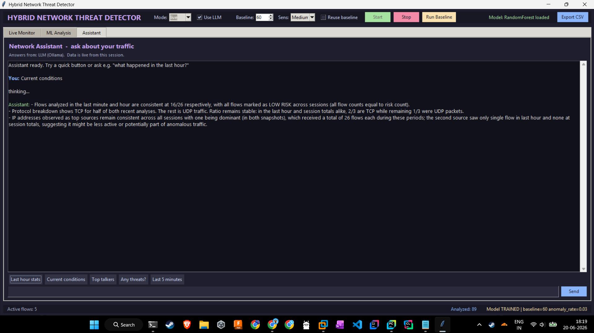
</p>

<p align="center">


-purple)


</p>

A hybrid network threat detection system that combines **supervised machine learning**, **unsupervised anomaly detection**, **rule-based signatures**, and **LLM-powered explanations** to detect, classify, and explain suspicious network traffic in real time.

The application provides an interactive desktop dashboard capable of monitoring live traffic, analyzing network flows, mapping attacks to the MITRE ATT&CK framework, generating explainable alerts, and exporting audit reports.

---

# Demo

## Dashboard

<p align="center">

</p>

## Live Flow Analysis

<p align="center">
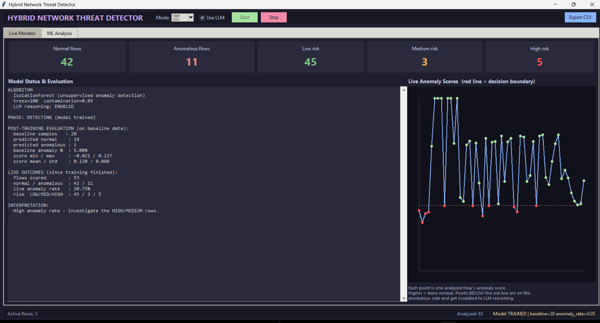
</p>

## Threat Details

<p align="center">
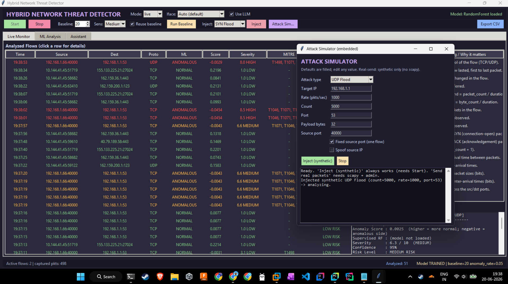
</p>

## ML Analysis

<p align="center">
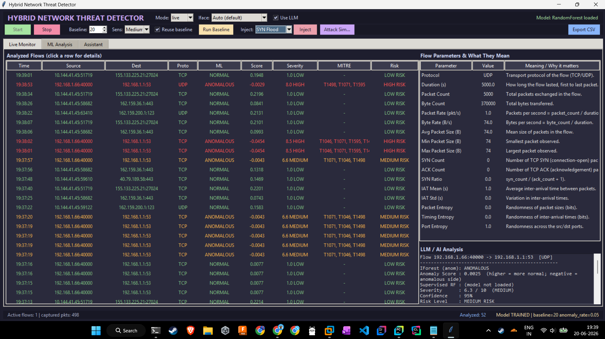
</p>

---

# Features

- Real-time packet capture using Scapy
- Bidirectional flow construction
- Statistical feature extraction
- Random Forest attack classification
- Isolation Forest anomaly detection
- Rule-based detection for common attacks
- MITRE ATT&CK technique mapping
- CVSS-style severity scoring
- LLM-generated threat explanation (Phi-3 via Ollama)
- Interactive Tkinter dashboard
- Built-in attack simulator
- CSV export
- JSON audit logging
- Baseline learning and persistence

---

# System Architecture

```
                Network Traffic
                       │
                       ▼
               Packet Capture (Scapy)
                       │
                       ▼
              Flow Construction Engine
                       │
                       ▼
              Feature Extraction Layer
                       │
        ┌──────────────┼──────────────┐
        │              │              │
        ▼              ▼              ▼
 Rule Engine    Isolation Forest   Random Forest
        │              │              │
        └──────────────┼──────────────┘
                       ▼
                Decision Fusion Engine
                       │
                       ▼
        MITRE + Severity + Confidence
                       │
                       ▼
              Phi-3 LLM Explanation
                       │
                       ▼
                Tkinter Dashboard
```

---

# Project Structure

```
Hybrid-Network-Threat-Analyzer
│
├── demo/
│   ├── img1.png
│   ├── img2.png
│   ├── img3.png
│   └── img4.png
│
├── model_eval/
│   ├── confusion_rf.png
│   ├── confusion_lr.png
│   ├── confusion_iforest.png
│   ├── roc_curves.png
│   ├── precision_recall.png
│   ├── feature_importance.png
│   ├── learning_curve.png
│   └── model_comparison.png
│
├── NETWORK GUI.py
├── attack_simulator.py
├── train_and_evaluate.py
├── threat_model.joblib
├── network_baseline.joblib
├── threat_audit_log.jsonl
└── README.md
```

---

# Detection Pipeline

### 1. Packet Capture

Network packets are captured using Scapy in live mode or generated using the built-in attack simulator.

↓

### 2. Flow Construction

Packets are grouped into bidirectional network flows.

↓

### 3. Feature Extraction

Each flow is converted into statistical features including

- Flow Duration
- Packet Count
- Byte Count
- Packet Rate
- Byte Rate
- Average Packet Size
- SYN Ratio
- IAT Mean
- IAT Standard Deviation
- Packet Entropy
- Timing Entropy
- Port Entropy

↓

### 4. Detection

Three independent detection engines analyze every flow.

- Random Forest (Known attacks)
- Isolation Forest (Unknown anomalies)
- Signature Rules (Floods, scans, C2, exfiltration)

↓

### 5. Decision Fusion

The outputs are combined into a single threat assessment.

↓

### 6. Threat Enrichment

The system adds

- MITRE ATT&CK mapping
- Severity score
- Confidence score
- Statistical evidence
- LLM explanation

---

# Attack Detection

The detector identifies patterns such as

| Attack | Detection Method |
|---------|------------------|
| SYN Flood | Signature + ML |
| UDP Flood | Signature + ML |
| Port Scan | Signature + ML |
| Data Exfiltration | ML + Rules |
| Command & Control Beacon | ML + Timing Analysis |
| Unknown Behaviors | Isolation Forest |

---

# Machine Learning Models

| Model | Purpose |
|--------|----------|
| Random Forest | Supervised attack classification |
| Isolation Forest | Unsupervised anomaly detection |
| Logistic Regression | Baseline comparison |

---

# Model Performance

| Model | Accuracy | Precision | Recall | F1 | ROC-AUC |
|--------|----------|-----------|--------|------|---------|
| Random Forest | **93.72%** | **93.14%** | **97.99%** | **95.50%** | **0.985** |
| Logistic Regression | 78.77% | 78.46% | 94.85% | 85.88% | 0.824 |
| Isolation Forest | 34.22% | 63.10% | 8.08% | 14.33% | 0.728 |

---

# Evaluation

## ROC Curves

<p align="center">
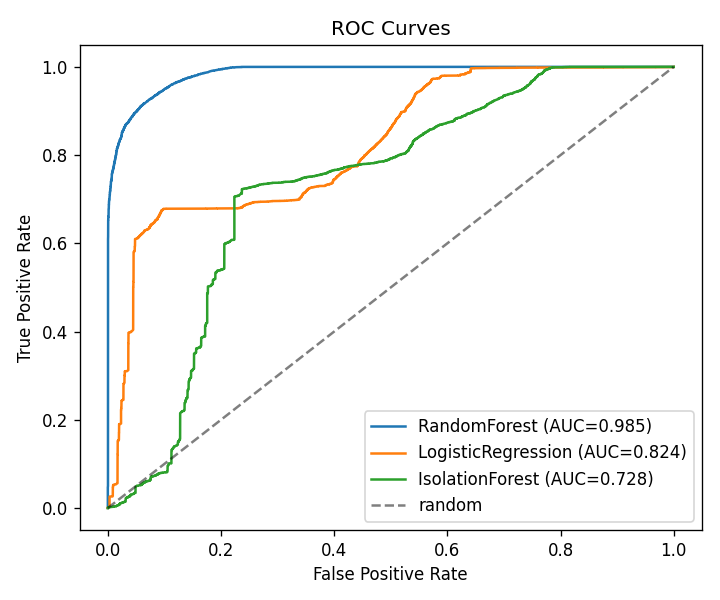
</p>

---

## Precision–Recall Curves

<p align="center">
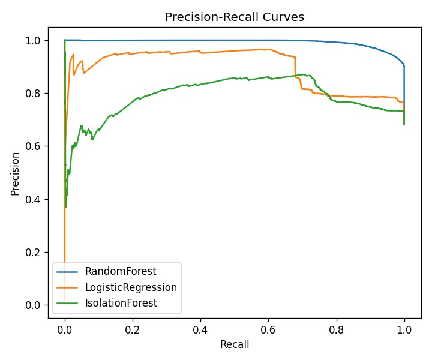
</p>

---

## Model Comparison

<p align="center">
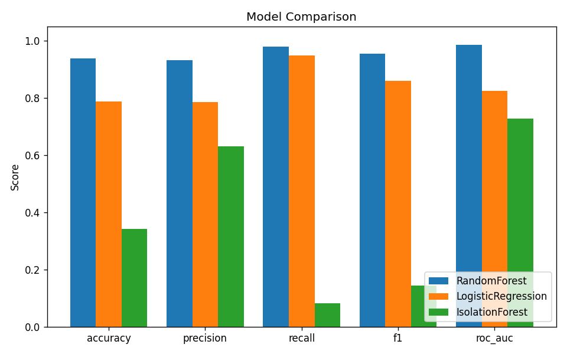
</p>

---

## Random Forest Confusion Matrix

<p align="center">
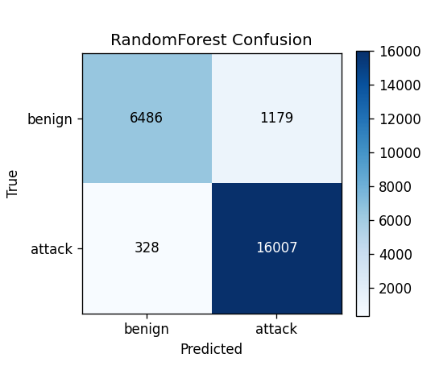
</p>

---

## Logistic Regression Confusion Matrix

<p align="center">
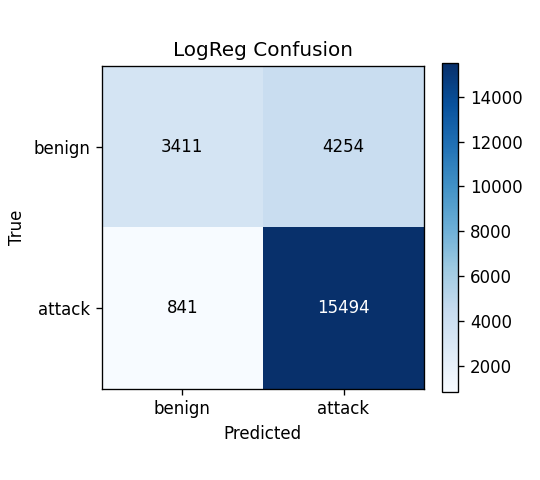
</p>

---

## Isolation Forest Confusion Matrix

<p align="center">
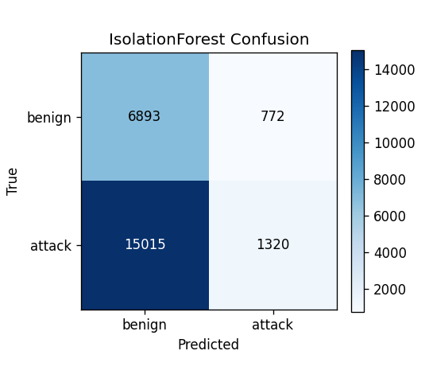
</p>

---

## Feature Importance

<p align="center">
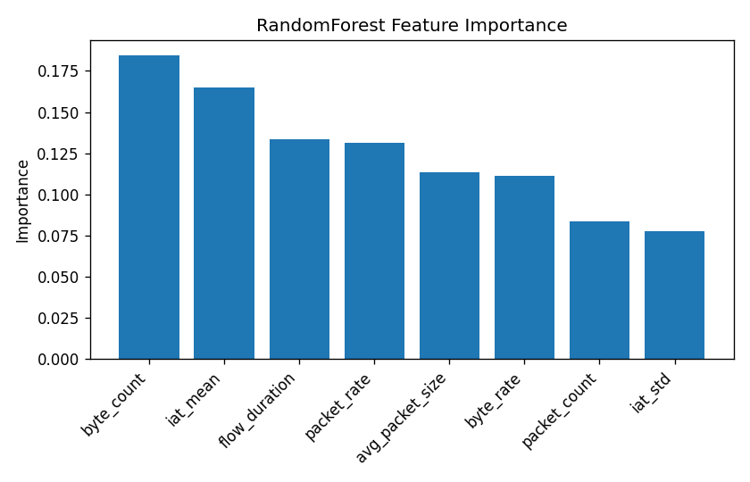
</p>

---

## Learning Curve

<p align="center">
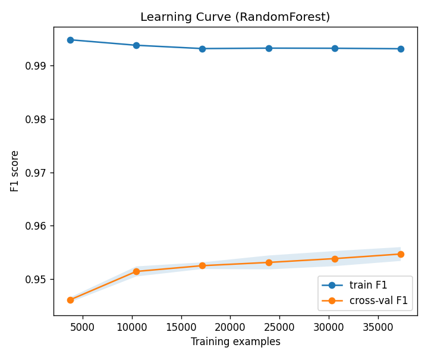
</p>

---

# Installation

```bash
git clone https://github.com/USERNAME/Hybrid-Network-Threat-Analyzer.git

cd Hybrid-Network-Threat-Analyzer
```

Install dependencies

```bash
pip install -r requirements.txt
```

Install Ollama

```bash
ollama pull phi3
```

Run

```bash
python "NETWORK GUI.py"
```

---

# Dashboard

The desktop application provides

- Live packet monitoring
- Risk-based color coding
- Detailed feature inspection
- Threat explanation
- Model analytics
- Interactive assistant
- Attack simulation
- CSV export
- Audit logging

---

# Technologies Used

- Python
- Scikit-learn
- Pandas
- NumPy
- Scapy
- Tkinter
- Matplotlib
- Ollama
- Phi-3
- Joblib

---


# License

This project is released under the MIT License.

---

# Acknowledgements

- UNSW-NB15 Dataset
- MITRE ATT&CK Framework
- Scapy
- Scikit-learn
- Ollama
- Microsoft Phi-3